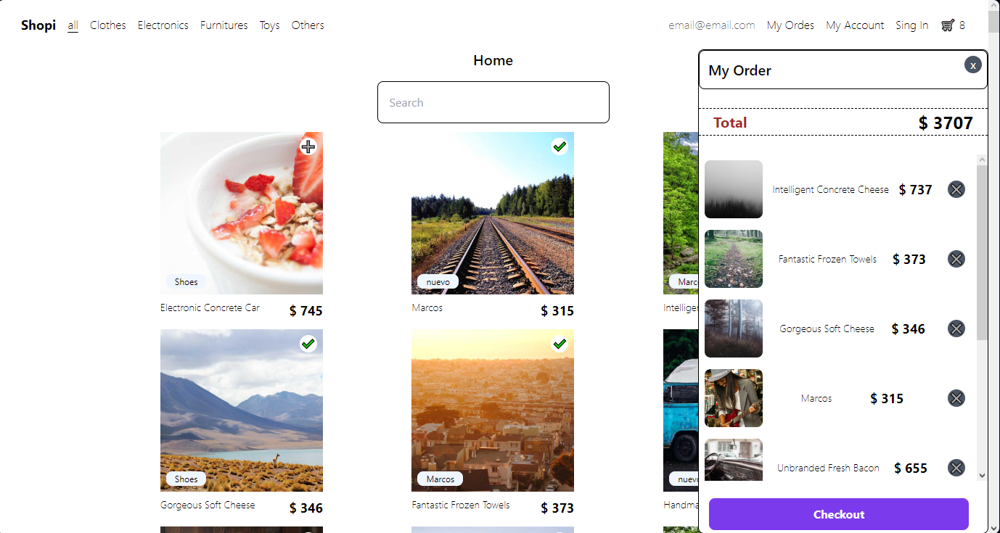

# Online store

This project makes use of the know-how of **React.js + Vite** to build a Website of a online store. [You can see it on this site: ]() 

- This site uses the [platzi FakeAPi](https://fakeapi.platzi.com) to get the products.
- We different functionalities: 
  - Show products
  - show products by category(...)
  - Show details of a product
  - Add a product to the shopping car
  - CheckOut the products of the shopping car.
  - See all the checked orders 
  - etc.

## Technical details 
- Basic Html 
- Css
- React Events
- React States
- React Custom Hooks
- React Effects
- React Context
- Git 
- GitHub
- Tailwind css
- Vite

## Contribute to the project
If you want to contribute, you can follow the next steps:
- Clone/fork this repository(ssh/http): `git clone git@github.com:jsalegria16/online-store-vitejs.git` / `git clone https://github.com/jsalegria16/online-store-vitejs.git`

- Go to the project directory and install all the modules and dependencies
    ```bash
    cd project_directory
    npm i
    ```
- Make all the changes you consider. To see the changes Runs the app in the development mode
    ```bash
    npm run dev
    ```
    Open http://localhost:5173 to view it in your browser. The page will reload when you make changes.

## Futures works
- Fix new bugs
- Use local Storage / Databases
- Login, and username.
